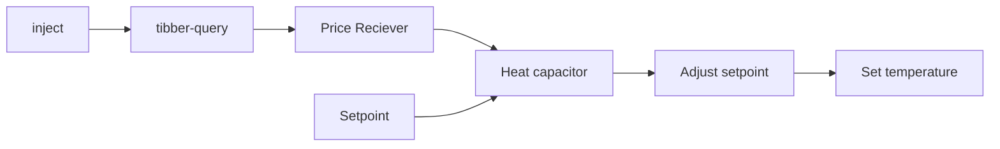
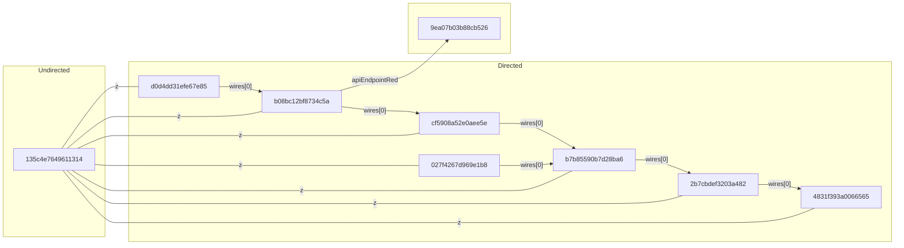

# 大作业：json模块提取
本题针对json文件进行处理。你可以查询互联网（如[RUNOOB](https://www.runoob.com/json/json-syntax.html)）或者咨询大语言模型，以了解json语法。

例如，下面是一种特定的json文件和它的图形化表示。文件包含9个结点的数组（以id作为标识，部分类型结点并未显示）。

```json
[
    {
        "id": "135c4e7649611314",
        "type": "tab",
        "label": "PowerSaver",
        "disabled": false,
        "info": "",
        "env": []
    },
    {
        "id": "cf5908a52e0aee5e",
        "type": "ps-receive-price",
        "z": "135c4e7649611314",
        "name": "Price Receiver",
        "x": 400,
        "y": 320,
        "wires": [
            [
                "b7b85590b7d28ba6"
            ]
        ]
    },
    {
        "id": "b08bc12bf8734c5a",
        "type": "tibber-query",
        "z": "135c4e7649611314",
        "name": "",
        "active": true,
        "apiEndpointRef": "9ea07b03b88cb526",
        "x": 230,
        "y": 320,
        "wires": [
            [
                "cf5908a52e0aee5e"
            ]
        ]
    },
    {
        "id": "d0d4dd31efe67e85",
        "type": "inject",
        "z": "135c4e7649611314",
        "name": "",
        "props": [
            {
                "p": "payload"
            },
            {
                "p": "topic",
                "vt": "str"
            }
        ],
        "repeat": "60",
        "crontab": "",
        "once": true,
        "onceDelay": "1",
        "topic": "",
        "payload": "{   
            viewer {     
                homes {        
                    currentSubscription {         
                        priceInfo {           
                            today {             
                                total             
                                startsAt           
                            }           
                            tomorrow {             
                                total             
                                startsAt           
                            }         
                        }       
                    }     
                }   
            } 
        }",
        "payloadType": "str",
        "x": 90,
        "y": 320,
        "wires": [
            [
                "b08bc12bf8734c5a"
            ]
        ]
    },
    {
        "id": "4831f393a0066565",
        "type": "api-call-service",
        "z": "135c4e7649611314",
        "name": "Set temperature",
        "server": "e2dd69fb.8f70a8",
        "version": 3,
        "debugenabled": false,
        "service_domain": "climate",
        "service": "set_temperature",
        "entityId": "climate.my_climate",
        "data": "{\"entity_id\":\"climate.my_climate\",\"temperature\":\"{{adj_setpoint}}\"}",
        "dataType": "json",
        "mergecontext": "",
        "mustacheAltTags": false,
        "outputProperties": [],
        "queue": "none",
        "x": 980,
        "y": 320,
        "wires": [
            []
        ]
    },
    {
        "id": "9ea07b03b88cb526",
        "type": "tibber-api-endpoint",
        "feedUrl": "wss://api.tibber.com/v1-beta/gql/subscriptions",
        "queryUrl": "https://api.tibber.com/v1-beta/gql",
        "name": "Tibber"
    },
    {
        "id": "027f4267d969e1b8",
        "type": "server-state-changed",
        "z": "135c4e7649611314",
        "name": "Setpoint",
        "server": "e2dd69fb.8f70a8",
        "version": 3,
        "exposeToHomeAssistant": false,
        "haConfig": [
            {
                "property": "name",
                "value": ""
            },
            {
                "property": "icon",
                "value": ""
            }
        ],
        "entityidfilter": "input_number.setpoint",
        "entityidfiltertype": "exact",
        "outputinitially": true,
        "state_type": "num",
        "haltifstate": "",
        "halt_if_type": "str",
        "halt_if_compare": "is",
        "outputs": 1,
        "output_only_on_state_change": false,
        "for": 0,
        "forType": "num",
        "forUnits": "minutes",
        "ignorePrevStateNull": false,
        "ignorePrevStateUnknown": false,
        "ignorePrevStateUnavailable": false,
        "ignoreCurrentStateUnknown": true,
        "ignoreCurrentStateUnavailable": true,
        "outputProperties": [
            {
                "property": "payload.config.setpoint",
                "propertyType": "msg",
                "value": "",
                "valueType": "entityState"
            },
            {
                "property": "data",
                "propertyType": "msg",
                "value": "",
                "valueType": "eventData"
            },
            {
                "property": "topic",
                "propertyType": "msg",
                "value": "",
                "valueType": "triggerId"
            }
        ],
        "x": 420,
        "y": 360,
        "wires": [
            [
                "b7b85590b7d28ba6"
            ]
        ]
    },
    {
        "id": "b7b85590b7d28ba6",
        "type": "ps-strategy-heat-capacitor",
        "z": "135c4e7649611314",
        "name": "Heat capacitor",
        "timeHeat1C": "70",
        "timeCool1C": 50,
        "maxTempAdjustment": "1",
        "boostTempHeat": "2",
        "boostTempCool": "2",
        "minSavings": 0.08,
        "setpoint": 23,
        "x": 600,
        "y": 320,
        "wires": [
            [
                "2b7cbdef3203a482"
            ],
            [],
            []
        ]
    },
    {
        "id": "2b7cbdef3203a482",
        "type": "function",
        "z": "135c4e7649611314",
        "name": "Adjust setpoint",
        "func": "//In case the climate entity can only handle integers\n//Calculate rounded setpoint for the climate entity and return the msg\nmsg.adj_setpoint=Math.round(msg.payload);\nreturn msg\n",
        "outputs": 1,
        "noerr": 0,
        "initialize": "",
        "finalize": "",
        "libs": [],
        "x": 800,
        "y": 320,
        "wires": [
            [
                "4831f393a0066565"
            ]
        ]
    }
]
```

图像化表示如下（注意部分结点未表示）:




我们可以重构结点之间的单向关系，包括：

- wires中的结点连接关系，代表当前结点和另外一组结点的连接关系，wires表明单向连接关系，后面跟随一个数组，本例子中，我们以wires[0]来构建连接关系。
- 属性关系，如某结点的属性"z": "135c4e7649611314" 表明该结点和"135c4e7649611314"结点存在z关联。

注意⚠️：

- 注意1：所有结点均通过id进行连接；我们忽略未在当前文件中定义的结点。
- 注意2：图中可能存在环。

图形示例如下：



我们希望从这个图中提取一部分子图，并以原形式予以保存。提取功能如下：
- 输入文件（或者目录），输入子图结点数量上界`m1`和下界`m2`，则提取出所有满足结点数量要求的子图（结点数组）。例如，用户输入`5 6`，则生成5个结点或者6个结点的模块文件，每个模块中结点均在当前模块中可达，示例结果如下表（部分结点文字内容省略）。
- 输出文件要求：所生成的模块文件还是json数组形式。文件命名规则如下：如果输入文件为`abc.json`，则输出文件为同一目录下的一组文件：`module_abc_5_2.json`，代表结点数量为5，第2个满足上述需求的模块文件。

这是 `module_abc_5_1.json` :
```json
[
    {
        "id": "135c4e7649611314",        
    },
    {
        "id": "4831f393a0066565",
        "type": "api-call-service",
        "z": "135c4e7649611314",
        "name": "Set temperature",
        "server": "e2dd69fb.8f70a8",        
        "wires": [
            []
        ]
    },
    {
        "id": "027f4267d969e1b8",
        "type": "server-state-changed",
        "z": "135c4e7649611314",
        "wires": [
            [
                "b7b85590b7d28ba6"
            ]
        ]
    },
    {
        "id": "b7b85590b7d28ba6",
        "type": "ps-strategy-heat-capacitor",
        "z": "135c4e7649611314",
        "wires": [
            [
                "2b7cbdef3203a482"
            ],
            [],
            []
        ]
    },
    {
        "id": "2b7cbdef3203a482",
        "type": "function",
        "z": "135c4e7649611314",
        
        "wires": [
            [
                "4831f393a0066565"
            ]
        ]
    },
]
```

这是 `module_abc_5_2.json` :
```json
[
    {
        "id": "135c4e7649611314",        
    },
    {
        "id": "cf5908a52e0aee5e",
        "type": "ps-receive-price",
        "z": "135c4e7649611314",        
        "wires": [
            [
                "b7b85590b7d28ba6"
            ]
        ]
    },
    {
        "id": "4831f393a0066565",
        "type": "api-call-service",
        "z": "135c4e7649611314",
        "name": "Set temperature",
        "server": "e2dd69fb.8f70a8",        
        "wires": [
            []
        ]
    },
    {
        "id": "b7b85590b7d28ba6",
        "type": "ps-strategy-heat-capacitor",
        "z": "135c4e7649611314",
        "wires": [
            [
                "2b7cbdef3203a482"
            ],
            [],
            []
        ]
    },
    {
        "id": "2b7cbdef3203a482",
        "type": "function",
        "z": "135c4e7649611314",
        
        "wires": [
            [
                "4831f393a0066565"
            ]
        ]
    },
]
```

这是 `module_abc_6_1.json` :
```json
[
    {
        "id": "135c4e7649611314",        
    },
    {
        "id": "cf5908a52e0aee5e",
        "type": "ps-receive-price",
        "z": "135c4e7649611314",        
        "wires": [
            [
                "b7b85590b7d28ba6"
            ]
        ]
    },
    {
        "id": "4831f393a0066565",
        "type": "api-call-service",
        "z": "135c4e7649611314",
        "name": "Set temperature",
        "server": "e2dd69fb.8f70a8",        
        "wires": [
            []
        ]
    },
    {
        "id": "027f4267d969e1b8",
        "type": "server-state-changed",
        "z": "135c4e7649611314",
        "wires": [
            [
                "b7b85590b7d28ba6"
            ]
        ]
    },
    {
        "id": "b7b85590b7d28ba6",
        "type": "ps-strategy-heat-capacitor",
        "z": "135c4e7649611314",
        "wires": [
            [
                "2b7cbdef3203a482"
            ],
            [],
            []
        ]
    },
    {
        "id": "2b7cbdef3203a482",
        "type": "function",
        "z": "135c4e7649611314",
        
        "wires": [
            [
                "4831f393a0066565"
            ]
        ]
    },
]
```
---

## 扩展功能：
用户可以指定1个或者多个属性名，则在计算过程中，不构建该属性相关的连接，例如，用户指定 z ，则提取子图过程中，不考虑 z 属性产生的连接关系。

## 输出文件要求：
如果输入文件为`abc.json`，则输出文件为同一目录下的一组文件：`module_abc_z_5_2.json`，代表`abc.json`文件中，不考虑z属性，结点数量为5，第2个满足上述需求的模块文件。

---

你的工具至少支持如下执行命令：
- `mytool <目标目录地址> [<下界>, <上界>]  [<指定0个或者多个标签>]` 
- `mytool <目标文件地址> [<下界>, <上界>]  [<指定0个或者多个标签>]` 

测试中，我们提供一组文件夹，请遍历访问该目录中所有json文件（这些文件不以'module'开头），生成相关的module文件（仍然放置在原目录中）。我们将根据生成结果情形，检查功能的完整性和正确性。 

## 提示：
你可以采用任意工具解析json文件格式，课程组将不做限定。请包含库文件，并在readme中明确标注执行方式。为了便于调试，你可以修改测试数据以进行实验。**如果测试数据存在问题，可以自动补全括号，或者直接报错**
